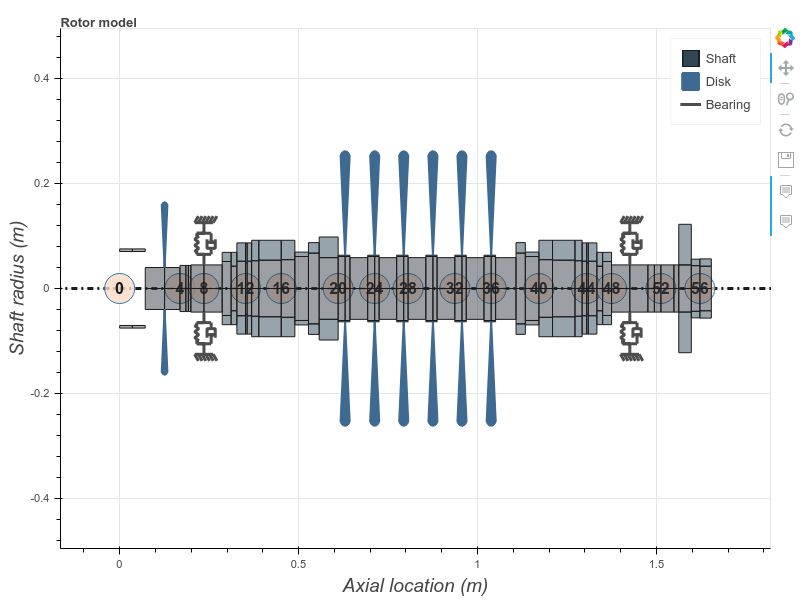

# Summary

There are several critical rotating equipment crucial to the industry, such as compressors,
pumps and turbines.
Computational mechanical models aim to simulate the behavior of such mechanical
systems [@childs1993turbomachinery; @gasch2006rotordynamik; @friswell2010dynamics; @vance2010machinery; @ishida2012linear].
These models are used to support research and decision making. To this purpose, we present ROSS,
an open source library written in Python for rotordynamic analysis.

Concerning rotordynamics softwares, there are some commercial finite element softwares that have a rotordynamic
module [@comsol; @ansys], some softwares based on a proprietary commercial software (MATLAB) [@madyn; @dynamicsrotating],
and others developed as standalone softwares [@rotorinsa; @trcsoftware].
To use these softwares one needs to buy licenses, and they are not intended to be developed in a collaborative public
manner. Currently, there are no softwares being developed using the open source concept, with the code being fully
available on code hosting platforms, issues tracked online, clear license, possibility of direct contribution, etc.

ROSS allows the construction of rotor models and their numerical simulation. Shaft elements, as a default, are
modeled with the Timoshenko beam theory [@Hutchinson2001], which considers shear and rotary inertia effects, and discretized by means of
the Finite Element Method [@friswell2010dynamics]. Disks are assumed to be rigid bodies, thus their strain energy is not taken
into account. And bearings/seals are included as linear stiffness/damping coefficients.

After defining the element matrices and assembling the global matrices of the system, ROSS draws the rotor geometry,
runs simulations, and obtains results in the form of graphics. It performs several analyses, such as static analysis,
whirl speed map, mode shapes, frequency response, and time response.

The general form of the equation for the system, after matrix assembly is

\begin{equation}\label{eq:general-form}
   \mathbf{M \ddot{q}}(t)
  + \mathbf{C}(\Omega) \mathbf{\dot{q}}(t)
  + \omega \mathbf{G} \mathbf{\dot{q}}(t)
  + \mathbf{K}(\Omega) \mathbf{{q}}(t)
  = \mathbf{f}(t)\,,
\end{equation}

where:
- $\textbf{q}$ is the generalized coordinates of the system (displacements and rotations);
- $\mathbf{M}$ is the mass matrix;
- $\mathbf{K}$ is the stiffness matrix;
- $\mathbf{C}$ is the damping matrix;
- $\mathbf{G}$ is the gyroscopic matrix;
- $\Omega$ is the excitation frequency;
- $\omega$ is the rotor whirl speed;
- $\mathbf{f}$ is the generalized force vector.

ROSS has been used to evaluate the impact of damper seal coefficients uncertainties in a compressor rotordynamics [@timbo2019]. 
Other projects are also using ROSS to test machine learning algorithms that can diagnose machine failure. Here we can create
a model with some problem such as unbalance or misalignment and then use the output data from this model to test the learning
algorithm and see how good it is in diagnosing the problem.

We have built the package using main Python packages such as NumPy [@van2011numpy] and SciPy [@jones2001scipy],
for their mathematical, engineering and array building tools; and Bokeh [@bokeh2019] for creating interactive plots.

Besides the [documentation](https://ross-rotordynamics.github.io/ross-website/), a set of Jupyter Notebooks
is available for the tutorial and some examples. Users can also access these notebooks through a [Binder server](https://mybinder.org/v2/gh/ross-rotordynamics/ross/master).

As an example, Figure 1 shows a centrifugal compressor modeled with ROSS.

The shaft elements are in gray,
the impellers represented as disks are in blue and the bearings are displayed as springs and dampers. This plot is generated with Bokeh,
and we can use the hover tool to get additional information on each element.

One analysis that can be carried out is the modal analysis. Figure 2 shows the whirl speed map generated for this
compressor; the natural frequencies and the log dec vary with the machine rotation speed.

The whirl speed map is one of the results that can be obtained from the model, other types of analysis can be found
in the [documentation](https://ross-rotordynamics.github.io/ross-website/).

Developing the software using python and its scientific ecosystem enables the user to also make use this ecosystem,
making it easier to run rotordynamics analysis. It is also easier to integrate the code into other programs, since we
only use open source packages and do not depend on proprietary commercial platforms. Therefore, ROSS is extensible to new
elements (e.g. beam, disk or bearing elements with 6 degrees of freedom) and types of analysis (e.g. torsional analysis).

# Acknowledgements
We acknowledge that ROSS development is supported by Petrobras, Universidade Federal do Rio de Janeiro (UFRJ) and 
Agência Nacional de Petróleo, Gás Natural e Biocombustíveis (ANP).

# References
